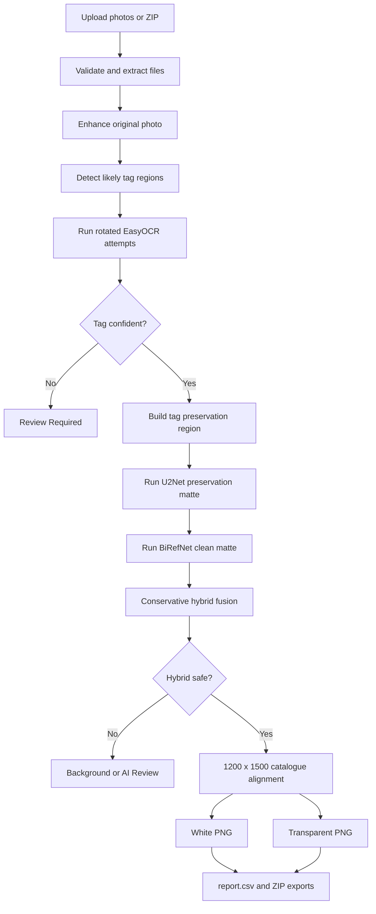

# Sunaar Jewellery Photo Tagger

Complete technical and operational documentation for the local Sunaar jewellery photo automation system.

## Project Identity

| Item | Value |
|---|---|
| Product | Sunaar Jewellery Photo Tagger |
| Canonical source | `E:\Codex\2026-06-20\jewellery-photo-tagger` |
| Application type | Local Streamlit desktop-style web app |
| Primary platform | Windows 11, 64-bit |
| Local address | `http://127.0.0.1:8501/` during development |
| Main language | Python |
| UI framework | Streamlit |
| OCR engine | EasyOCR |
| Background engines | U2Net + BiRefNet General Lite |
| External AI API | Not required |

## Purpose

The app converts raw jewellery photographs into catalogue-ready assets while keeping the original files untouched. It reads the visible numeric tag, renames the output by that tag, enhances the photo, removes the background, creates white and transparent outputs, records every decision in CSV, and routes uncertain work to review.

The system is designed for repeated office use by non-technical users. A batch can keep running while the user visits Dashboard, Download, Report, Settings, or Review pages.

## Quality Guarantees

The implementation follows these rules:

1. OCR always runs before background removal.
2. Original uploaded photos are never overwritten.
3. A numeric filename is created only when the OCR decision is acceptable.
4. Opposite tag rotations are compared before an ambiguous result is accepted.
5. BiRefNet is the clean final background matte.
6. U2Net cannot broadly overwrite the BiRefNet result.
7. U2Net may restore only narrow, connected, high-confidence jewellery edge pixels that BiRefNet omitted.
8. Grey floor, wood texture, shadows, and disconnected residue are rejected by the hybrid fusion.
9. Full-quality PNG and transparent outputs are never replaced by the optional 20 KB export.
10. Unsafe or genuinely uncertain results are kept for review instead of being silently finalized.

## End-to-End Workflow



## User Pages

### Dashboard

- Sunaar-branded workflow overview.
- Apple-inspired scrolling presentation and motion.
- Live batch counters when a processing job is active.
- Quick navigation to upload, processing, and download.

### Upload Photos

- Accepts one or many supported images.
- Accepts ZIP archives containing supported images.
- Creates a private runtime folder for the new batch.
- Does not alter source files.

### Settings

- Enhancement on or off.
- Fast or quality enhancement mode.
- OCR confidence threshold.
- Fast or thorough OCR attempts.
- Debug crop saving.
- Background removal and output mode.
- Hybrid U2Net + BiRefNet processing.
- Catalogue canvas dimensions.
- Optional HD output controls.

### Processing

- Starts one background job for the current batch.
- Shows current filename, counters, progress, and elapsed time.
- The job belongs to the runtime folder, not the currently visible page.
- Navigating away does not restart the batch.

### AI Review

- Shows difficult background candidates.
- Allows a safe candidate to be accepted.
- Keeps uncertain work out of normal final ZIPs.

### Review Required

- Shows the enhanced original and OCR evidence.
- Displays raw OCR text, confidence, and suggested tag.
- Allows manual tag correction.
- A saved correction updates the report and output archives.

### Report

- Reads `report.csv`.
- Supports status inspection and search.
- Provides traceability for OCR, filename, and background decisions.

### Download

- Browser downloads remain available.
- Windows users can choose a local destination folder.
- Individual files or all artifacts can be saved.
- An optional compressed JPEG ZIP is generated on demand.

## Supported Inputs

- `.jpg`
- `.jpeg`
- `.png`
- `.webp`
- `.heic` when `pillow-heif` is available
- `.zip` containing supported images

Unsupported and corrupt files are logged without stopping the complete batch.

## Image Enhancement

`src/image_enhancement.py` performs conservative product-photo enhancement:

- Noise reduction.
- Brightness and contrast normalization.
- CLAHE local contrast improvement.
- Controlled sharpening.
- OCR-specific crop preprocessing.

The normal production path does not use Real-ESRGAN. It previously produced tiled or corrupt output on this machine and remains disabled to protect image quality.

## Tag Detection and OCR

### Detection

`src/tag_detection.py` searches for likely light rectangular tag regions and also generates safe fallback crops. Debug crops can be saved for diagnosis.

### OCR

`src/ocr_engine.py` wraps EasyOCR and loads the exact local detector and English recognizer. OCR attempts use discrete rotations so number order is not changed by geometric interpolation.

### Direction Safety

- Opposite rotations are completed before early acceptance.
- Conflicting reverse numbers use confidence and crop consensus.
- A close reverse conflict goes to review.
- The `122069` versus `690221` regression is covered by tests.

### Parsing

`src/tag_parser.py` selects a 5-8 digit numeric tag. Long alphanumeric product codes are ignored. Duplicate tags receive safe filename suffixes instead of overwriting an earlier output.

## Hybrid Background Removal

### Stage 1: U2Net Preservation Signal

U2Net supplies a broad, conservative view of possible foreground. Its raw matte is useful for detecting jewellery that another model might miss, but it may include wood grain, shadows, or floor residue. For that reason U2Net is not the final output matte.

### Stage 2: BiRefNet Clean Base

BiRefNet General Lite processes the original enhanced photo and supplies the authoritative clean matte. It normally produces the cleaner catalogue boundary.

### Stage 3: Conservative Fusion

`src/background_processor.py` keeps every existing BiRefNet pixel unchanged. U2Net may add a pixel only when all relevant checks pass:

- BiRefNet omitted the pixel.
- U2Net has meaningful foreground confidence.
- Source colour looks like a saturated gem, textured bright gold, pearl, or bright stone.
- The pixel is within a narrow edge distance from BiRefNet foreground.
- The restored component is connected to the accepted object.

This arrangement preserves jewellery without restoring broad grey or wood patches.

### Safety Decisions

The processor measures:

- Foreground area.
- Removed source-supported area.
- Interior holes.
- Lost or missing coloured components.
- Retained background residue.
- Largest residue component.

Safe hybrid results are finalized. Low-confidence candidates go to review.

## Catalogue Output

The default final canvas is portrait `1200 x 1500` pixels.

- Product remains proportional.
- Product is centered with stable margins.
- White output is saved as PNG.
- Transparent output retains an alpha channel.
- The visible tag is not intentionally removed.

## Runtime Output Structure

Each batch receives a private folder under `.runtime/` and contains:

```text
Jewellery_Output/
  processed_images/
  transparent_images/
  compressed_images_20kb/
  review_required/
  background_review/
  debug_crops/
  report.csv
  Jewellery_Output.zip
  processed_images.zip
  transparent_images.zip
  compressed_images_20kb.zip
  debug_crops.zip
```

### Full-Quality Output

`processed_images` contains the normal white-background catalogue PNGs. `transparent_images` contains equivalent transparent PNGs when enabled.

### 20 KB Export

`compressed_images_20kb` is generated only when requested:

- White-background JPEG.
- Tag-number filename.
- Every included file is no larger than `20,000` bytes.
- Adaptive quality and proportional resizing are used.
- Full-quality PNGs remain unchanged.

## report.csv

| Column | Meaning |
|---|---|
| `item_id` | Stable item identifier inside the batch |
| `original_filename` | Uploaded source filename |
| `detected_tag_number` | OCR or corrected numeric tag |
| `ocr_text_raw` | OCR evidence collected from attempts |
| `confidence_score` | Selected OCR confidence |
| `final_filename` | Final output filename |
| `output_folder` | Folder receiving the item |
| `status` | Overall processing status |
| `notes` | OCR and processing notes |
| `background_status` | Background pipeline decision |
| `background_mode` | White, transparent, or combined mode |
| `transparent_filename` | Transparent output filename |
| `background_notes` | Model, fusion, and safety details |

Common overall statuses:

- `OK`
- `REVIEW_REQUIRED`
- `DUPLICATE_TAG`
- `OCR_FAILED`
- `TAG_NOT_FOUND`
- `ERROR`

Common background statuses:

- `AI_HYBRID_OK`
- `AI_MANUAL_REVIEW`
- `REVIEW_REQUIRED`
- `MANUAL_ACCEPTED`
- `ORIGINAL_KEPT`
- `FAILED`

## Source Architecture

| File | Responsibility |
|---|---|
| `app.py` | Streamlit entry point, pages, session state, and navigation |
| `src/models.py` | Settings, result structures, statuses, and report schema |
| `src/job_manager.py` | Persistent background processing job state |
| `src/processor.py` | End-to-end batch orchestration and per-file isolation |
| `src/image_enhancement.py` | Enhancement and OCR crop preprocessing |
| `src/tag_detection.py` | Tag crop detection, rotations, and preservation mask |
| `src/ocr_engine.py` | EasyOCR adapter and compatibility handling |
| `src/tag_parser.py` | Numeric tag selection and conflict rules |
| `src/background_processor.py` | U2Net, BiRefNet, matte cleanup, fusion, and safety |
| `src/file_manager.py` | Runtime folders, uploads, duplicates, and ZIP creation |
| `src/report_generator.py` | CSV read, write, and update operations |
| `src/compressed_export.py` | Strict 20 KB JPEG conversion and ZIP |
| `src/local_export.py` | Native Windows destination selection and local saving |
| `src/download_server.py` | Local download links for packaged Windows use |
| `src/model_bootstrap.py` | Exact OCR and background model setup |
| `src/ui_components.py` | Dashboard styling, animation, badges, and shared UI |
| `src/ai_enhancement.py` | Optional enhancement integration kept outside normal flow |

## Local Developer Setup

```powershell
cd E:\Codex\2026-06-20\jewellery-photo-tagger
python -m venv .venv
.\.venv\Scripts\Activate.ps1
python -m pip install --upgrade pip
python -m pip install -r requirements-lock.txt
```

Run:

```powershell
streamlit run app.py --server.address 127.0.0.1 --server.port 8501
```

Open `http://127.0.0.1:8501/`.

## Locked Core Dependencies

- Streamlit `1.59.1`
- OpenCV `5.0.0.93`
- EasyOCR `1.7.2`
- Pillow `12.3.0`
- NumPy `2.4.6`
- rembg `2.0.76`
- ONNX Runtime `1.27.0`
- Torch `2.13.0`

The complete transitive lock is stored in `requirements-lock.txt`.

## Exact Bundled Models

| Model | File | Size | SHA-256 |
|---|---|---:|---|
| EasyOCR CRAFT detector | `craft_mlt_25k.pth` | 83,152,330 | `4A5EFBFB48B4081100544E75E1E2B57F8DE3D84F213004B14B85FD4B3748DB17` |
| EasyOCR English recognizer | `english_g2.pth` | 15,143,997 | `E2272681D9D67A04E2DFF396B6E95077BC19001F8F6D3593C307B9852E1C29E8` |
| U2Net preservation model | `u2net.onnx` | 175,997,641 | `8D10D2F3BB75AE3B6D527C77944FC5E7DCD94B29809D47A739A7A728A912B491` |
| BiRefNet final-cut model | `birefnet-general-lite.onnx` | 224,005,088 | `5600024376F572A557870A5EB0AFB1E5961636BEF4E1E22132025467D0F03333` |

The Windows launcher verifies model size and checksum before every setup or launch.

## Windows Package

Build a fully bundled package from the canonical source:

```powershell
powershell -NoProfile -ExecutionPolicy Bypass -File .\tools\build_windows_package.ps1 `
  -WheelhouseSource E:\path\to\wheelhouse-py314-win-amd64
```

The builder:

1. Copies the exact canonical application source.
2. Excludes runtime batches, private photos, caches, and local virtual environments.
3. Bundles the private signed Python `3.14.6` 64-bit runtime with Tkinter.
4. Creates a verified portable Python repair archive.
5. Bundles all four exact AI models.
6. Bundles all exact Windows/Python 3.14 dependency wheels.
7. Generates source, runtime, dependency, and model manifests with SHA-256 hashes.
8. Produces `Sunaar-Jewellery-Tagger-Windows.zip`.

### First Use on an Office PC

1. Download the ZIP.
2. Right-click and select `Extract All`.
3. Open the extracted `Sunaar-Jewellery-Tagger-Windows` folder.
4. Double-click `Install or Repair Dependencies.bat`; Internet is not required.
5. Wait for the green verification message.
6. Use the automatically created desktop shortcut, or run `Run Sunaar Jewellery Tagger.bat`.
7. Keep the launcher window open while the app is in use.

Python does not need to be preinstalled. The package contains its own verified Python runtime and can repair it without changing the app code.

### Package Verification

The launcher checks:

- Package source manifest.
- Dependency lock hash.
- Python version and 64-bit architecture.
- Tkinter availability.
- Portable Python repair archive.
- Offline dependency wheel manifest and every wheel checksum.
- EasyOCR model hashes.
- U2Net model hash.
- BiRefNet model hash.
- Required imports after installation.

## Testing

Run all automated tests:

```powershell
python -m pytest -q
```

Test groups cover:

- OCR parsing and direction conflicts.
- Tag detection and rotations.
- Background mask safety.
- Hybrid jewellery preservation and residue rejection.
- Processor success, review, duplicate, and corrupt-image paths.
- Runtime job persistence during page navigation.
- Report and ZIP generation.
- Local folder exports.
- Strict 20 KB JPEG limits.
- Download server byte accuracy.
- Windows package contracts, Python runtime, and model manifests.

## Validated Regression Photos

The real-photo regression set includes tags such as:

- `120739`
- `120741`
- `120748`
- `121995`
- `121998`
- `122015`
- `122016`
- `122030`
- `122039`
- `122069`
- `122071`
- `122074`
- `122104`
- `122130`
- `122526`
- `122528`

Important regressions:

- `122069` must not become `690221`.
- `121995` and `122130` must be readable on clear tags.
- Thin chains, pearls, separate earrings, and hanging beads must remain present.
- Grey wood residue must not be restored by U2Net fusion.

## Performance Expectations

Performance depends on CPU, photo dimensions, and first model load.

- First photo after a fresh process is slower because EasyOCR and ONNX sessions load.
- A measured U2Net + BiRefNet background stage on the current development PC takes about `17-19 seconds` per representative photo.
- A complete cold OCR-to-output run can take roughly `50-65 seconds` for the first photo.
- Later photos benefit from cached OCR and model sessions.
- The stricter hybrid fusion itself is lightweight and does not add another model inference.

## Privacy and Network Behaviour

- Uploaded photos are processed locally.
- No external AI API key is required.
- Normal processing does not upload photos to an AI service.
- The fully offline office package bundles checksum-verified Python wheels, so a new
  office PC does not need Internet access for dependency installation.
- Bundled models allow later model inference to run offline.

## Troubleshooting

### App Does Not Open

Run `Install or Repair Dependencies.bat`, wait for the green success message, then start the app again.

### Tkinter Missing

The launcher restores the bundled private Python runtime and verifies Tkinter `8.6`. Do not manually copy a separate Tkinter quick-fix into a current package.

### Smart App Control or Antivirus Warning

Use the batch launcher when an unsigned convenience EXE is blocked. The package source, Python installer, runtime, and models are verified by manifests and hashes. Do not disable security globally.

### Model Missing or Corrupt

Run `Install or Repair Dependencies.bat`. The launcher rejects a wrong-size or wrong-hash model instead of silently switching quality.

### OCR Sends a Clear Tag to Review

Check `debug_crops`, glare, focus, and tag size. Use Review Required for a manual correction. Keep the original photo available for regression testing.

### Background Has Residue

Confirm Hybrid AI finish is enabled. Current logic uses BiRefNet as the base and prevents broad U2Net residue restoration. Keep the input and output together when reporting a new case.

### Jewellery Part Is Missing

Do not accept the candidate blindly. Use the background review action to keep the original photo, and add the pair to the regression set.

### Download Link Returns 404

Use the current app tab and current run. Packaged mode starts a local download server with a dynamic port and serves only the active runtime root.

## Release Checklist

Before sharing a Windows ZIP:

1. Run the complete automated suite.
2. Verify every required model hash.
3. Build from the canonical project path.
4. Extract the ZIP into a fresh folder.
5. Run dependency setup from the fresh extraction.
6. Verify the desktop shortcut.
7. Start the app and confirm local health.
8. Process at least one real jewellery photo.
9. Confirm tag, white PNG, transparent PNG, report, and ZIP downloads.
10. Compare packaged output with the validated local output.
11. Run a second clean extraction startup check.
12. Publish the ZIP with a SHA-256 checksum.

## Known Limitations

- No OCR system can guarantee perfect results for hidden, blurred, overexposed, or tiny tags.
- Extremely difficult backgrounds may still require manual review.
- A local CPU is slower than a dedicated GPU service.
- The 20 KB export necessarily reduces dimensions or JPEG quality to meet the strict byte limit.
- Full-quality PNG should remain the master catalogue asset.

## Change Control

For future development:

- Make changes only in the canonical source directory.
- Test locally before building a Windows ZIP.
- Never edit an extracted office package as the source of truth.
- Never replace a model without updating size, SHA-256, tests, and documentation.
- Never change OCR parsing or mask thresholds without adding a regression case.
- Keep old verified releases as backups; build new releases in a new versioned folder.
